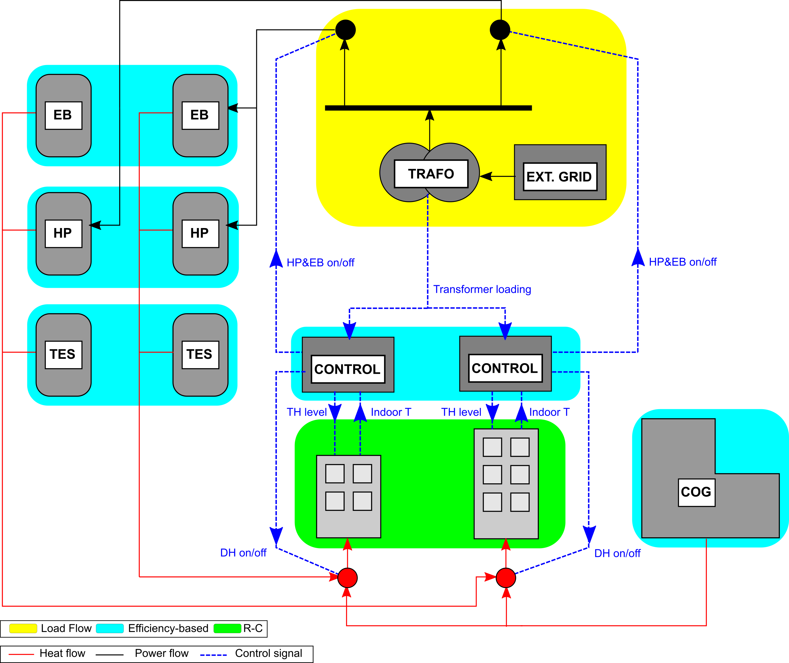

Introduction
========================

The aim of this project is to make available models developed along the work published 
in the PhD thesis "A co-simulation based framework for the analysis of integrated urban 
energy systems" [M.Arnaudo]_.

The project folder contains sample scenarios that demonstrate the usage of the main co-simulation 
based models. These scenarios are called Scenario 1 and Scenario 2. 
They involve different energy systems, as described in the following sections. 
However, the approach to the models set up (:ref:`How-to-set-up-the-models`) 
and simulations run (:ref:`How-to-run-the-models`) is the same. 
A Swedish residential neighnorhood located in Stockholm is used a reference case.

Scenario 1
---------------------

This scenario aims at assessing the technical feasibility of using distributed heat pumps as an independent heating infrastructure in the reference case.
It is expected that heat peak demand could hit the capacity limits of the local electricity distribution grid. Consequently, a district heating network is 
kept as a backup solution. :ref:`SC1_CoGraph` illustrates the main components of the heating infrastructure for two buildings (sample for the sake of clarity).
Each component is associated with the corresponding modelling approach. All the components are linked through the ZerOBNL co-ismulation platform (:ref:`The_co-simulation_platform`).
This scenario and the models are fully described in [M.Arnaudo_PIII]_ .

.. _SC1_CoGraph:

   Figure 1
   
Scenario 2
---------------------

TBD: one building with HP, PV and battery.

